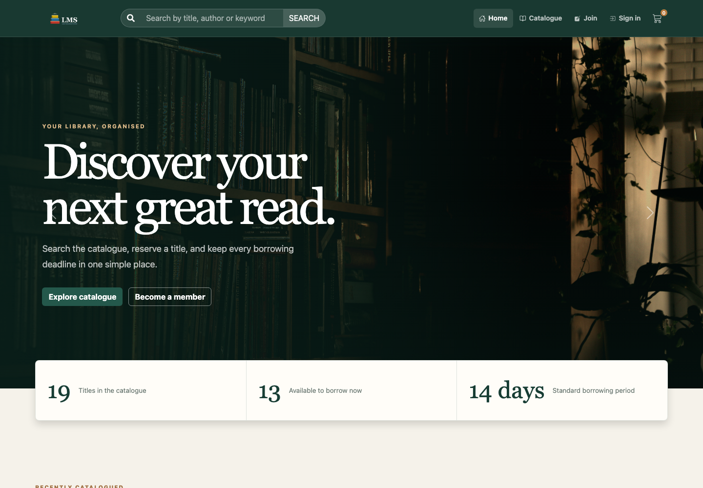
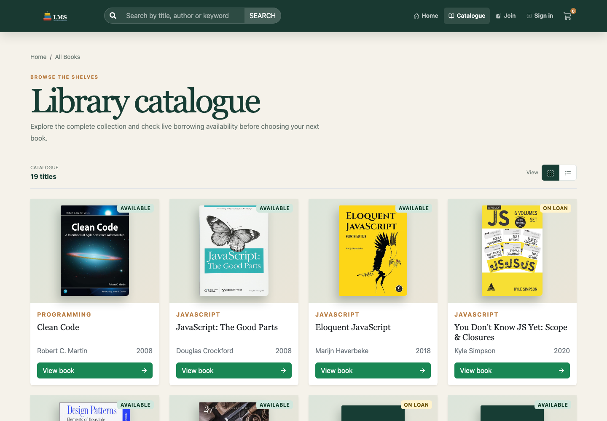
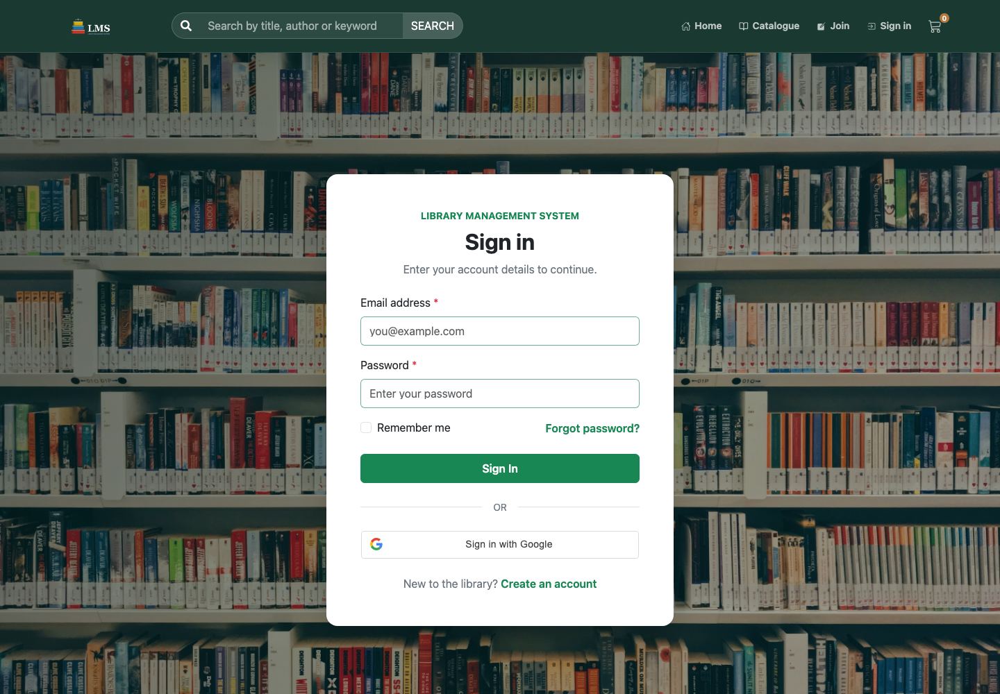

<div align="center">
  

# Library Management System — Frontend

A responsive React application for discovering books, managing borrowing, and running day-to-day library operations.

</div>



## Overview

This is the browser application for the Library Management System. It provides a public catalogue, member borrowing workflows, role-aware dashboards, review management, password authentication, and Google sign-in. Live data is supplied by the companion [Backend-LMS API](https://github.com/SudanBasnet/Backend-LMS).

## Features

- Public homepage, catalogue, search, book details, availability, and reviews
- Member cart, borrowing history, returns, profile, and review submission
- Admin inventory, circulation history, review moderation, and user management
- Email registration, account activation, password reset, and Google OAuth
- Automatic access-token renewal using the existing LMS session flow
- Persistent borrowing cart with Redux Persist
- Responsive interface built primarily with React Bootstrap

## Screenshots

| Catalogue | Google sign-in |
| --- | --- |
|  |  |

## Technology

- React 19 and Vite 8
- React Router
- Redux Toolkit, React Redux, and Redux Persist
- Axios
- React Bootstrap and Bootstrap 5
- React Toastify and React Icons

## Project structure

```text
src/
├── assets/          Static images and form definitions
├── components/      Shared UI, layouts, forms, tables, and sections
├── features/        Redux slices, API helpers, and async actions
├── hooks/           Reusable React hooks
├── pages/           Public, member, and administrator pages
├── redux/           Store and persistence configuration
├── routes/          Public and protected route definitions
├── services/        Shared API and authentication clients
└── utils/           Session and token helpers
```

## Getting started

### Prerequisites

- Node.js `20.19+` or `22.12+`
- npm
- A running [Backend-LMS](https://github.com/SudanBasnet/Backend-LMS) server

### Installation

```bash
git clone https://github.com/SudanBasnet/Frontend-LMS.git
cd Frontend-LMS
npm install
cp .env.example .env
```

Configure `.env`:

```env
VITE_BASE_URL=http://localhost:8080
VITE_GOOGLE_CLIENT_ID=your-google-web-client-id.apps.googleusercontent.com
```

Start the development server:

```bash
npm run dev
```

The application runs at `http://localhost:5173` by default.

## Google OAuth setup

Create an OAuth client in Google Cloud with application type **Web application**. Add `http://localhost:5173` and the deployed frontend origin under **Authorized JavaScript origins**. Use the same Client ID in the frontend and backend environment files.

The Google Client Secret is not used by this ID-token flow and must never be placed in a `VITE_` environment variable.

## Authentication storage

| Data | Location |
| --- | --- |
| LMS access token | Browser `sessionStorage` |
| LMS refresh token | Browser `localStorage` |
| Current profile | Redux state |
| Borrowing cart | Redux Persist / browser storage |
| Google ID credential | Sent to the API for verification and not stored by the application |

## Main routes

| Route | Access | Purpose |
| --- | --- | --- |
| `/` | Public | Homepage and featured books |
| `/all-books` | Public | Complete catalogue |
| `/book/:slug` | Public | Book details and approved reviews |
| `/login`, `/signup` | Public | Password and Google authentication |
| `/cart` | Public | Selected books before borrowing |
| `/users` | Member | Account dashboard |
| `/users/my-borrow` | Member | Borrowing and return history |
| `/users/books` | Admin | Book inventory management |
| `/users/borrow-history` | Admin | Library-wide circulation history |
| `/users/reviews` | Admin | Review moderation |

## Scripts

| Command | Description |
| --- | --- |
| `npm run dev` | Start the Vite development server |
| `npm run build` | Create a production build |
| `npm run preview` | Preview the production build locally |
| `npm run lint` | Run ESLint across the project |

## Related repository

- [Backend-LMS](https://github.com/SudanBasnet/Backend-LMS) — Express API, MongoDB models, authentication, borrowing, reviews, and uploads
